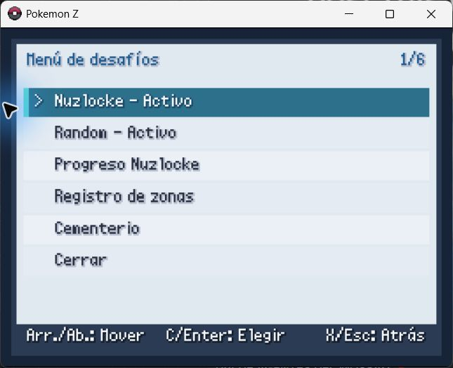
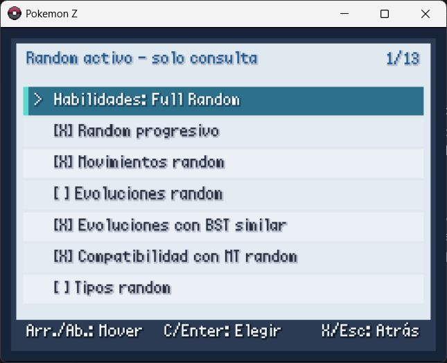
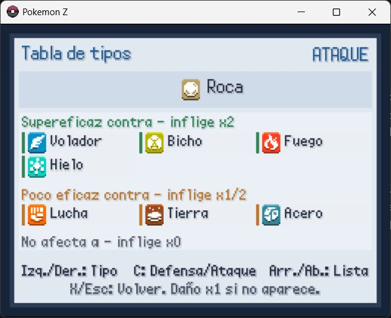
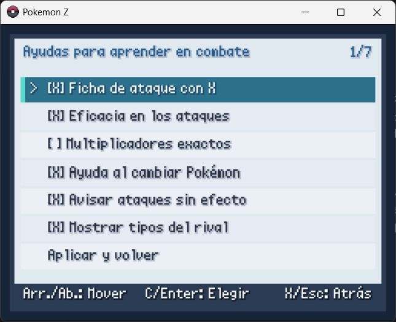

# Pokémon Z Mods

[Español](README.md) · [English](README.en.md) · [Français](README.fr.md)

Configurable challenge mod for the Spanish, English and French editions of **Pokémon Z**. It adds enforced Nuzlocke, Random and Randomlocke from the first playthrough, setup wizards, in-battle learning aids and an integrated type chart.

> This repository does not include Pokémon Z, ROMs, executables, graphics, music or save files. You need a legally obtained copy of a supported edition.

## Supported editions

| Tested edition | Profile | Default mod language |
| --- | --- | --- |
| Pokémon Z **2.18 Spanish** | `es_218` | Español |
| Pokémon Z **2.13 English** | `en_213` | English |
| Pokémon Z **2.12 French + Patch 1** | `fr_212p1` | Français |

Pokémon names, move names and move descriptions come from each game's localized data. Every menu, explanation and notification added by the mod is translated. The mod language can be changed at any time under Options without changing the base game's language.

## Quick installation

1. Close the game and back up its folder and save files.
2. Download this repository with **Code > Download ZIP** and extract it.
3. Open PowerShell in the extracted folder.
4. Run the following command with the path to your game:

```powershell
powershell -ExecutionPolicy Bypass -File .\install.ps1 -GamePath "C:\Games\Pokemon Z V2.13" -Language auto
```

`auto` detects the edition, language and compatibility profile. You can explicitly use `-Language es`, `-Language en` or `-Language fr`. The installer backs up `preload.rb` and `mkxp.json`, enables the loader, safely handles the broken legacy Zlib wrapper in 2.12/2.13 and never modifies `Data\Scripts.rxdata`. It is safe to run the same command again to update the mod.

See [INSTALL.md](INSTALL.md) for manual installation, updating, uninstalling and troubleshooting.

## First-playthrough setup

Nuzlocke and Random are available immediately; completing the game is no longer required. After the initial Nuzlocke question, selecting **Yes** opens its setup wizard. The game then always asks whether Random should be enabled and, if accepted, opens the Random setup wizard.

This supports four starting modes:

- Normal game: Nuzlocke and Random disabled.
- Nuzlocke: only the enforced Locke rules are active.
- Random: only the randomizer is active.
- Randomlocke: Nuzlocke and Random are active together.

Typical settings start enabled. Selecting any setting opens a full explanation, describes its gameplay impact and asks for a Yes/No confirmation before changing it. `Apply and continue` saves the configuration. Nuzlocke and Random settings are locked to that save once play begins; learning aids remain editable.

## Enforced Nuzlocke

### Mandatory rules

| Rule | Effect |
| --- | --- |
| **Permadeath** | A Pokémon that reaches 0 HP is marked dead, cannot be revived or returned to the party, and is moved automatically to the `CEMETERY` PC box. |
| **First encounter** | Only the first valid encounter in each area may be caught. Fainting it or fleeing records the opportunity as missed. Dupes and shiny exemptions are evaluated first. |
| **One catch per area** | Every logical area has one normal catch. Maps grouped into one location share their state unless method or subarea settings split them. |

### Configurable rules

| Setting | Default | Effect |
| --- | --- | --- |
| **Dupes clause (evolution line)** | On | An encounter from an evolution line already obtained is ignored and does not consume the area. Its capture is blocked so another encounter can be found. |
| **Exact species clause** | On | A species already obtained is treated as a duplicate without requiring the full evolution-line check. |
| **Shiny clause** | On | A shiny may be caught even after the area is used. It is logged as an extra catch and does not replace the normal area catch. |
| **Level caps** | On | Experience is capped by story progress. Configured caps are levels 17, 27, 36, 42, 50, 56, 70, 75, 80, 85, 94 and 100. |
| **No battle items** | On | Healing, boost and similar Bag items are blocked in battle. Poké Balls remain available for legal captures and held items are not removed. |
| **Set style** | On | Enforces Set battle style, removing the free switch offered after an opposing Pokémon faints. |
| **Gifts consume the area** | Off | Gift Pokémon and Eggs use the area where they are received. A used area blocks the gift; duplicate and shiny clauses still apply. Off means gifts are exempt. |
| **Static encounters consume the area** | On | Visible, static and event-started Pokémon count as that area's encounter. Off makes them exempt. |
| **Grass/water/fishing share the area** | On | Land, cave, Surf and fishing use one shared opportunity. Off gives each method a separate opportunity. |
| **Each submap counts separately** | Off | Every internal map or floor becomes its own area. Off groups floors and segments belonging to the same logical place. |

Illegal Poké Balls are returned with an explanation. Double encounters, shiny Pokémon, gifts and duplicates follow their configured clauses. `Nuzlocke progress` reports current area, catches, missed encounters, extra shiny catches, deaths and the level cap. `Area records` shows each location's encounter and catch state. If no usable Pokémon remain, the run is marked failed without making the save unusable.

## Random mode

Random tables are generated and saved for the playthrough, so species, abilities, evolutions and other results remain consistent.

### Ability mode

| Mode | Default | Effect |
| --- | --- | --- |
| **Full Random** | Selected | Every species receives new random abilities. |
| **Consistent mapping** | Not selected | Every original ability maps to one stable random replacement throughout the save. |
| **Do not randomize** | Not selected | Keeps the species' normal abilities. |

### Configurable Random settings

| Setting | Default | Effect |
| --- | --- | --- |
| **Progressive Random** | On | Restricts species base strength and move power according to earned badges, avoiding extreme early-game results. |
| **Random moves** | On | Gives each species a random learnset; Progressive Random also scales available power. |
| **Random evolutions** | Off | Replaces evolutions with stable random species saved for the playthrough. |
| **Similar-BST evolutions** | On | When evolutions are randomized, prefers a target with similar base-stat total. It has no practical effect while Random evolutions is off. |
| **Random TM compatibility** | On | Randomizes which TMs each Pokémon can learn. |
| **Random types** | Off | Assigns stable random types, changing STAB, weaknesses, resistances and immunities. |
| **Random field items** | On | Replaces non-essential map pickups while protecting key items. |
| **Random held items** | On | Allows wild Pokémon to carry safe random items. |
| **Random trainer rewards** | Off | Allows some defeated trainers to grant an extra random reward. |
| **Semi Random mode** | Off | Limits randomization to encounters and gifts; trainers, moves, abilities and items keep their normal behavior. |

Generations **1 through 9** start enabled and can be toggled individually. The randomizer only selects species from enabled generations and prevents the last enabled generation from being disabled.

## Battle learning aids

These settings work in normal, Nuzlocke, Random and Randomlocke games. They can be changed at any time under Options, with the same explanation and confirmation screen.

| Aid | Default | Effect |
| --- | --- | --- |
| **Move details with X** | On | Press `X` over a battle move to see its type icon and name, physical/special/status category, power, accuracy, PP, priority, effectiveness and localized description. |
| **Move effectiveness** | On | Labels damaging moves as `SUPER EFFECTIVE`, `NOT VERY EFFECTIVE`, `NORMAL` or `NO EFFECT`; status moves display `STATUS`. |
| **Exact multipliers** | Off | Uses the actual combined multiplier (`x0`, `x0.25`, `x0.5`, `x1`, `x2`, `x4`, etc.) in move and switch help. |
| **Switch matchup help** | On | While browsing the party during a switch, compares the candidate's offensive and defensive type matchup with the active opponent. |
| **Warn about no-effect moves** | On | Requests confirmation before using a damaging move with an `x0` multiplier. Status moves are not interrupted. |
| **Show opponent types** | On | Displays the active opponent's type names above the move selector. |

## Type chart and menus

The integrated chart uses the game's type icons and translated type names. Left/Right changes type, `C` switches between Defense and Attack, Up/Down scrolls long lists and `X` or Escape returns. Relations are shown as `x2`, `x1/2` and `x0` in a safe multi-column layout, including Rock's longer attack list.

During battle, press `R` in the move selector to open the chart immediately. Closing it returns to the same selected move without spending the turn or changing the choice. The move selector shows `R: Types` next to the `X: Info` shortcut.

Added entries:

- **Options → Challenges:** Nuzlocke/Random configuration and status, progress, area records and Cemetery.
- **Options → Battle learning aids:** all six learning settings.
- **Options → Type chart:** offensive and defensive type reference.
- **Options → Mod language:** Español, English or Français.
- **Pause menu → Challenges:** opens the same challenge center.

## Screenshots

| Challenges | Random setup |
| --- | --- |
|  |  |

| Type chart | Battle learning aids |
| --- | --- |
|  |  |

## Diagnostics

The game creates `Mods\HardcoreNuzlocke\nuzlocke.log`. A correct startup includes:

```text
Installation self-test PASS (12 hooks)
Compatibility profile PASS: en_213; language=en
```

If the game closes or a screen fails to open, attach that log, the exact game edition and the list of other installed mods to the issue.

## Legal notice

Free, unofficial fan project. Pokémon and its trademarks belong to their respective owners. This project is not affiliated with or endorsed by Nintendo, Game Freak, Creatures Inc. or The Pokémon Company.
