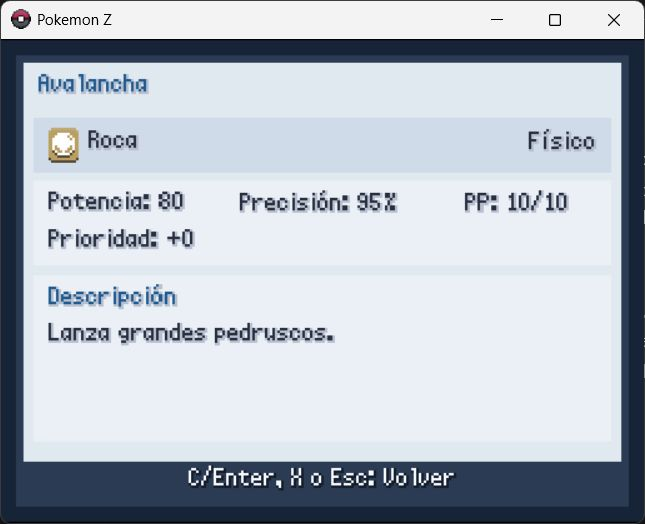
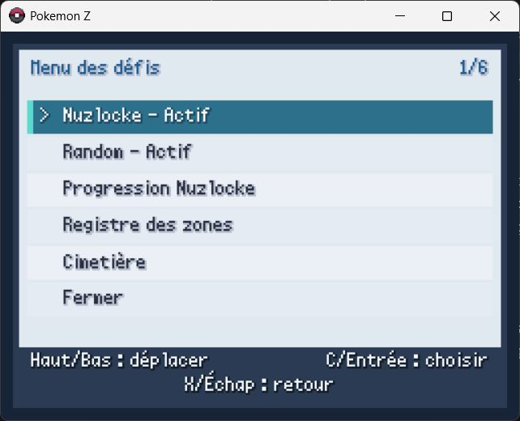

# Pokémon Z Mods

[Español](README.md) · [English](README.en.md) · [Français](README.fr.md)

Mod de desafíos configurables para las ediciones española, inglesa y francesa de **Pokémon Z**. Añade Nuzlocke forzado, Random y Randomlocke desde la primera partida, asistentes de configuración, ayudas de aprendizaje en combate y una tabla de tipos integrada.

> Este repositorio no incluye Pokémon Z, ROMs, ejecutables, gráficos, música, partidas guardadas ni otros recursos del juego. Necesitas una copia obtenida legalmente de una edición compatible.

## Instalación rápida

1. Cierra el juego y haz una copia de seguridad de su carpeta y de tus partidas.
2. Descarga `Pokemon-Z-Mods-v1.0.0.zip` desde [la última release](https://github.com/Calatravo/pokemon_mods/releases/latest) y descomprímelo.
3. En Windows, haz doble clic en `Install Pokemon Z Mods.cmd` y selecciona la carpeta que contiene `Game.exe`.

También puedes usar PowerShell, cambiando la ruta por la de tu instalación:

```powershell
powershell -ExecutionPolicy Bypass -File .\install.ps1 -GamePath "C:\Juegos\Pokemon Z V2.18" -Language auto
```

`auto` detecta la edición por sus archivos (aunque se haya renombrado la carpeta) y selecciona el idioma y perfil compatibles. También se puede indicar `-Language es`, `-Language en` o `-Language fr`. El instalador copia el mod a `Mods\HardcoreNuzlocke`, guarda copias de seguridad de `preload.rb` y `mkxp.json`, activa el cargador y corrige el wrapper Zlib defectuoso incluido en 2.12/2.13. **No modifica `Data\Scripts.rxdata`.** Puedes volver a ejecutar el mismo comando para actualizar el mod.

Consulta [PLATFORMS.md](PLATFORMS.md) para Android/JoiPlay, Steam Deck, Linux, macOS y el estado de iOS, o [INSTALL.md](INSTALL.md) para la instalación manual, verificación, actualización, solución de problemas y desinstalación.

## Configuración inicial y guardado

Nuzlocke y Random se pueden elegir desde la primera partida; ya no es necesario completar antes el juego. Después de la pregunta inicial de Nuzlocke, el mod abre su configuración si se ha elegido **Sí** y, a continuación, siempre pregunta si se desea activar Random. Si se acepta, abre también el asistente Random.

Esto permite comenzar en cualquiera de los cuatro modos:

- **Partida normal:** Nuzlocke y Random desactivados.
- **Nuzlocke:** solo están activas las reglas Locke.
- **Random:** solo está activo el randomizador.
- **Randomlocke:** Nuzlocke y Random funcionan a la vez.

Cada asistente muestra todas sus opciones, con los ajustes habituales ya preseleccionados. Al elegir una opción aparece su explicación, el efecto sobre la partida y una confirmación **Sí/No** para activarla o desactivarla. `Aplicar y continuar` guarda la configuración.

La configuración de Nuzlocke y Random queda vinculada y bloqueada en ese guardado una vez iniciada la partida. Se puede consultar después, pero no relajar sus reglas a mitad de la run. Las ayudas de combate sí se pueden cambiar en cualquier momento.

## Nuzlocke forzado

### Reglas obligatorias

Estas tres reglas siempre están activas en el modo Nuzlocke forzado y no se pueden desmarcar:

| Regla | Qué hace |
| --- | --- |
| **Muerte permanente** | Cuando un Pokémon del equipo llega a 0 PS queda marcado como muerto. No puede revivir, recuperar PS ni regresar al equipo y se traslada automáticamente a una caja llamada `CEMENTERIO`. |
| **Primer encuentro** | Solo se puede capturar el primer encuentro válido de cada zona. Si se debilita o se huye, la oportunidad queda registrada como perdida. Los duplicados y shiny exentos se resuelven antes de decidir cuál es el primer encuentro válido. |
| **Una captura por zona** | Cada zona lógica dispone de una sola captura normal. Los mapas agrupados como una misma zona comparten su estado, salvo que las opciones de métodos o subzonas indiquen lo contrario. |

### Opciones configurables

| Opción | Valor inicial | Qué hace |
| --- | --- | --- |
| **Cláusula dupes (línea evolutiva)** | Activada | Si ya se obtuvo cualquier miembro de la línea evolutiva del encuentro, este se ignora, no consume la zona y su captura se bloquea para permitir buscar otro encuentro. Por ejemplo, haber obtenido un Pidgey convierte también a Pidgeotto y Pidgeot en duplicados. |
| **Cláusula de especie exacta** | Activada | Una especie que ya se obtuvo se considera repetida y no consume el primer encuentro. Comprueba la especie exacta, aunque no se aplique la comprobación de toda la línea evolutiva. |
| **Cláusula shiny** | Activada | Permite capturar un Pokémon shiny aunque la zona ya esté usada. Se registra como captura extra y no sustituye ni consume la captura normal de la zona. |
| **Topes de nivel** | Activada | Limita la experiencia según el progreso de la historia y evita superar el tope actual. La secuencia configurada es nivel 17, 27, 36, 42, 50, 56, 70, 75, 80, 85, 94 y 100. |
| **Sin objetos en combate** | Activada | Bloquea objetos de curación, potenciadores y otros objetos de la mochila durante el combate. Las Poké Balls siguen disponibles cuando la captura es legal; los objetos equipados no se eliminan. |
| **Estilo Fijo** | Activada | Fuerza el estilo de combate Fijo. Al derrotar a un Pokémon rival no se ofrece un cambio gratuito antes de que entre el siguiente. |
| **Los regalos consumen zona** | Desactivada | Si se activa, Pokémon regalados y huevos consumen la oportunidad de la zona donde se reciben. Si esa zona ya está usada, el regalo se bloquea; las cláusulas de duplicados y shiny también se respetan. Desactivada, los regalos y huevos son capturas exentas. |
| **Los estáticos consumen zona** | Activada | Hace que Pokémon visibles, estáticos o iniciados mediante un evento cuenten como el encuentro de la zona. Si se desactiva, esos encuentros quedan exentos. |
| **Hierba/agua/pesca comparten zona** | Activada | Hierba, cuevas, Surf y pesca usan una única oportunidad de captura para el lugar. Si se desactiva, cada método de encuentro dispone de su propia oportunidad. |
| **Cada submapa cuenta aparte** | Desactivada | Si se activa, cada mapa interno, planta o piso se trata como una zona independiente. Desactivada, los pisos y tramos configurados como el mismo lugar comparten la captura. |

### Aplicación de las reglas y seguimiento

- Una Poké Ball usada sobre una captura no permitida se devuelve y el juego explica por qué se ha bloqueado.
- En un encuentro doble solo cuenta el primer Pokémon válido; shiny y duplicados se tratan conforme a sus cláusulas.
- Al activar la run se registran las especies que el jugador ya posee para que las cláusulas de duplicados sean coherentes.
- El Cementerio guarda nombre, especie, nivel, lugar y fecha de cada baja. Los Pokémon muertos no se pueden retirar ni mover de nuevo al equipo.
- Si no queda ningún Pokémon capaz de combatir, la run se marca como terminada. El historial se conserva y el guardado no queda inutilizado.
- `Progreso Nuzlocke` muestra estado de la run, zona actual, capturas, encuentros perdidos, shiny extra, muertes y tope de nivel.
- `Registro de zonas` muestra el estado de cada lugar, su primer encuentro y la captura conseguida, si la hubo.

La agrupación concreta de mapas en zonas se puede adaptar en [`Config/areas.rb`](mod/HardcoreNuzlocke/Config/areas.rb), y los valores iniciales y topes están en [`Config/rules.rb`](mod/HardcoreNuzlocke/Config/rules.rb).

## Modo Random

Al aplicar Random se generan y guardan las tablas necesarias para esa partida. Las elecciones quedan bloqueadas para que especies, evoluciones, habilidades y demás resultados sean consistentes durante todo el guardado. La selección de generaciones se aplica antes de generar los iniciales.

### Habilidades

Es una opción de tres estados, no un simple interruptor:

| Modo | Valor inicial | Qué hace |
| --- | --- | --- |
| **Full Random** | Seleccionado | Cada especie recibe habilidades nuevas aleatorias. Es la variante con más cambios. |
| **Mapeo consistente** | No seleccionado | Sustituye cada habilidad original por otra habilidad aleatoria mediante un mapeo estable: la misma habilidad de origen produce siempre el mismo reemplazo dentro de la partida. |
| **Sin randomizar** | No seleccionado | Conserva las habilidades normales de las especies. |

### Opciones configurables

| Opción | Valor inicial | Qué hace |
| --- | --- | --- |
| **Random progresivo** | Activada | Limita la fuerza base de las especies y la potencia de los movimientos según las medallas obtenidas. Evita recibir legendarios o ataques extremos demasiado pronto. |
| **Movimientos random** | Activada | Asigna a cada especie un repertorio de movimientos aleatorio. Con Random progresivo activo, la potencia disponible se adapta al avance de la partida. |
| **Evoluciones random** | Desactivada | Cambia las evoluciones por especies aleatorias. El resultado se fija en el guardado para que una misma evolución no cambie cada vez. |
| **Evoluciones con BST similar** | Activada | Cuando las evoluciones random están activas, intenta elegir una especie con una suma de estadísticas base parecida y reduce saltos de poder desproporcionados. No tiene efecto práctico si `Evoluciones random` está desactivada. |
| **Compatibilidad con MT random** | Activada | Genera al azar qué MT puede aprender cada Pokémon, modificando su compatibilidad normal. |
| **Tipos random** | Desactivada | Asigna tipos aleatorios y consistentes a las especies. Cambia STAB, inmunidades, debilidades y resistencias. |
| **Objetos del mapa random** | Activada | Randomiza las recogidas únicas visibles y ocultas. Protege objetos clave, MO y megapiedras. Los nodos renovables (árboles, rocas, cajas de materiales y plantas de bayas) conservan sus recursos normales para impedir una fuente infinita de objetos random. |
| **Regalos de eventos random** | Desactivada | Randomiza regalos y recompensas no esenciales entregados directamente por eventos. Los objetos clave, MO y megapiedras permanecen protegidos. |
| **Objetos equipados random** | Activada | Permite que los Pokémon salvajes lleven objetos aleatorios, respetando las listas de seguridad del juego. |
| **Recompensas random de entrenadores** | Desactivada | Permite que algunos entrenadores derrotados entreguen una recompensa aleatoria adicional. |
| **Modo Semi Random** | Desactivada | Limita la aleatorización a encuentros y Pokémon regalados. Entrenadores, movimientos, habilidades y objetos mantienen su comportamiento normal; por ello actúa como una variante reducida frente a las demás opciones. |

Al recoger un objeto del mapa o recibirlo de un evento o una recompensa, el juego conserva sus avisos habituales y abre después otra ventana con la descripción localizada del objeto. Solo aparece si el objeto entra realmente en la mochila, se muestra una vez aunque se reciban varias unidades y, con Random activo, describe el objeto que se ha recibido tras la sustitución.

### Generaciones permitidas

Las generaciones **1 a 9** están activadas inicialmente. Cada generación se puede permitir o excluir por separado y el randomizador solo escogerá especies de las generaciones marcadas. El asistente impide desactivar la última: siempre debe quedar al menos una generación disponible.

## Ayudas para aprender en combate

Las ayudas son independientes de Nuzlocke y Random: funcionan también en una partida normal y pueden activarse o desactivarse en cualquier momento desde Opciones. Cada cambio abre primero una explicación y una confirmación.

| Ayuda | Valor inicial | Qué hace |
| --- | --- | --- |
| **Ficha de ataque con X** | Activada | Al pulsar `X` sobre un movimiento en el selector de combate abre una pantalla con nombre, icono y nombre del tipo, categoría física/especial/estado, potencia, precisión, PP, prioridad, eficacia contra el rival activo y descripción. |
| **Eficacia en los ataques** | Activada | Añade a cada movimiento de daño la etiqueta `MUY EFICAZ`, `POCO EFICAZ`, `NORMAL` o `SIN EFECTO` contra el rival activo. Los movimientos de estado muestran `ESTADO` para no sugerir una eficacia de daño falsa. |
| **Multiplicadores exactos** | Desactivada | Sustituye las etiquetas generales por el multiplicador combinado real: `x0`, `x0.25`, `x0.5`, `x1`, `x2`, `x4`, etc. También hace que la ayuda al cambiar Pokémon use multiplicadores. |
| **Ayuda al cambiar Pokémon** | Activada | Mientras se recorre el equipo durante un cambio en combate, compara los tipos del candidato con los del rival. Muestra su mejor relación ofensiva (`Atq eficaz/débil/neutro`) y el riesgo defensivo (`Def débil/resiste/neutra`), o los multiplicadores si esa ayuda está activa. Es una comparación de tipos, no una predicción completa de daño, estadísticas o movimientos conocidos. |
| **Avisar ataques sin efecto** | Activada | Antes de confirmar un movimiento de daño con multiplicador `x0`, pregunta si realmente se desea usar. No interrumpe movimientos de estado. |
| **Mostrar tipos del rival** | Activada | Muestra los nombres de los tipos del rival activo en la parte superior del selector de movimientos. |

## Tabla de tipos y menús de consulta

La tabla integrada usa los iconos del juego y nombres traducidos por el mod. `Izquierda/Derecha` cambia el tipo, `C` alterna entre la vista de defensa y ataque, `Arriba/Abajo` desplaza las relaciones cuando no caben y `X` o `Esc` vuelve. La vista muestra relaciones `x2`, `x1/2` y `x0`, distribuidas en columnas para que listas extensas como Roca en ataque permanezcan dentro de la pantalla.

Durante un combate, `R` abre directamente la tabla desde el selector de movimientos. Al cerrarla se vuelve al mismo ataque seleccionado, sin consumir el turno ni modificar la elección. El propio selector muestra el recordatorio `R: Tipos` junto al acceso `X: Info`.

Los accesos añadidos son:

- **Opciones → Desafíos - Abrir:** estado y configuración de Nuzlocke y Random, progreso, registro de zonas y Cementerio.
- **Opciones → Ayudas de combate - Configurar:** todos los interruptores de aprendizaje descritos arriba.
- **Opciones → Tabla de tipos - Abrir:** referencia ofensiva y defensiva de tipos.
- **Opciones → Idioma del mod:** cambia al instante entre Español, English y Français y guarda la elección en la partida.
- **Menú de pausa → Desafíos:** abre el mismo centro de consulta; también se conserva el atajo indicado en pantalla como `S/R` según el sistema de entrada del juego.

La documentación interna y técnica adicional está en [la documentación del módulo](mod/HardcoreNuzlocke/README.md).

## Pantallazos

| Desafíos configurables | Configuración Random |
| --- | --- |
|  |  |

| Tabla de tipos | Ayudas de combate |
| --- | --- |
|  |  |

| Información de un movimiento |
| --- |
|  |

| Edición francesa |
| --- |
|  |

## Idiomas y compatibilidad

| Edición probada | Perfil | Idioma inicial |
| --- | --- | --- |
| Pokémon Z **V2.18 española** | `es_218` | Español |
| Pokémon Z **V2.13 inglesa** | `en_213` | English |
| Pokémon Z **V2.12 francesa + Patch 1** | `fr_212p1` | Français |

- Los nombres de Pokémon, movimientos y sus descripciones se obtienen de los datos de cada edición; los textos propios del mod están traducidos íntegramente.
- El idioma del mod puede cambiarse después desde Opciones sin reinstalar ni alterar el idioma base del juego.
- El instalador requiere una distribución con `Game.exe`, `preload.rb`, `mkxp.json` y `Data\Scripts.rxdata` en la carpeta principal.
- Otros mods que reemplacen los mismos métodos pueden causar incompatibilidades. Conserva siempre la copia de seguridad.

## Estado y diagnóstico

Al iniciar el juego se crea `Mods\HardcoreNuzlocke\nuzlocke.log`. Una carga correcta termina con:

```text
PASS (14 hooks)
```

La línea siguiente debe indicar también `Compatibility profile PASS` con el perfil de la edición instalada.

Si el juego se cierra o una pantalla no abre, adjunta ese registro al crear una incidencia.

## Aviso legal

Proyecto de aficionados, gratuito y no oficial. Pokémon y sus marcas pertenecen a sus respectivos propietarios. Este proyecto no está afiliado, respaldado ni patrocinado por Nintendo, Game Freak, Creatures Inc. ni The Pokémon Company.
