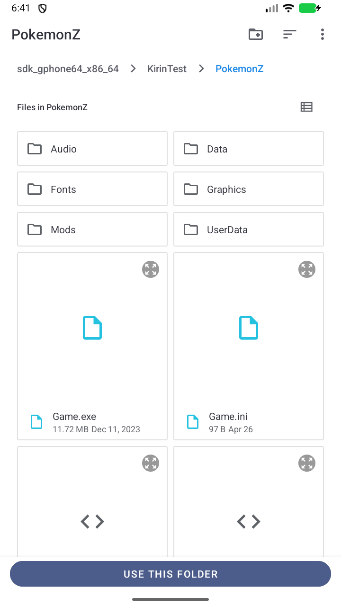
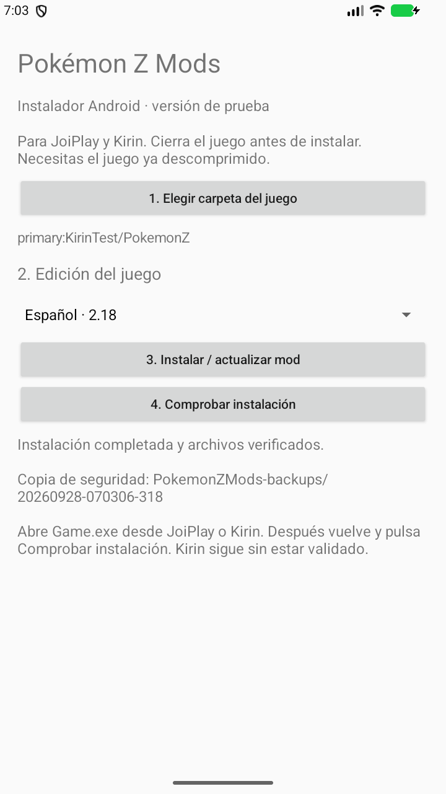
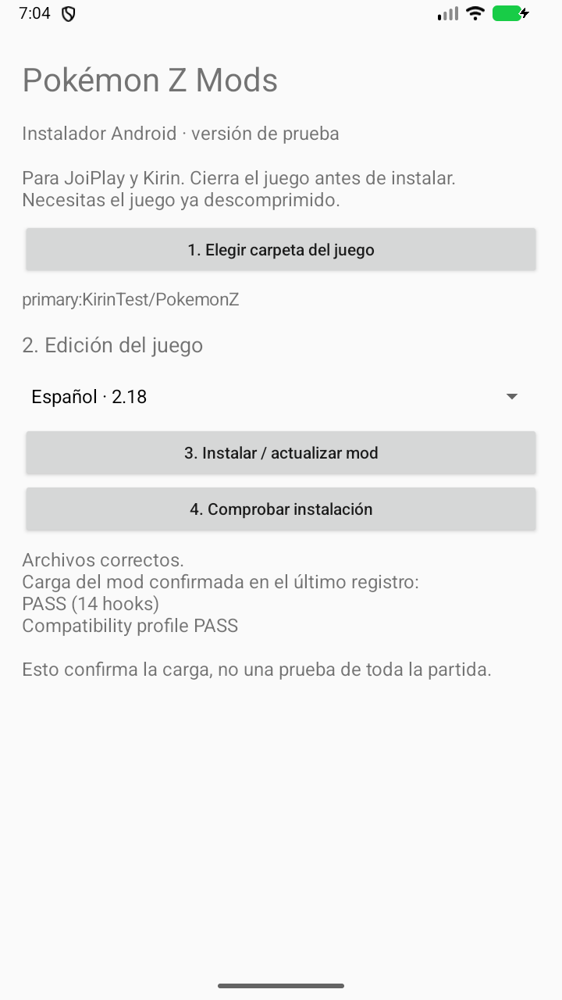
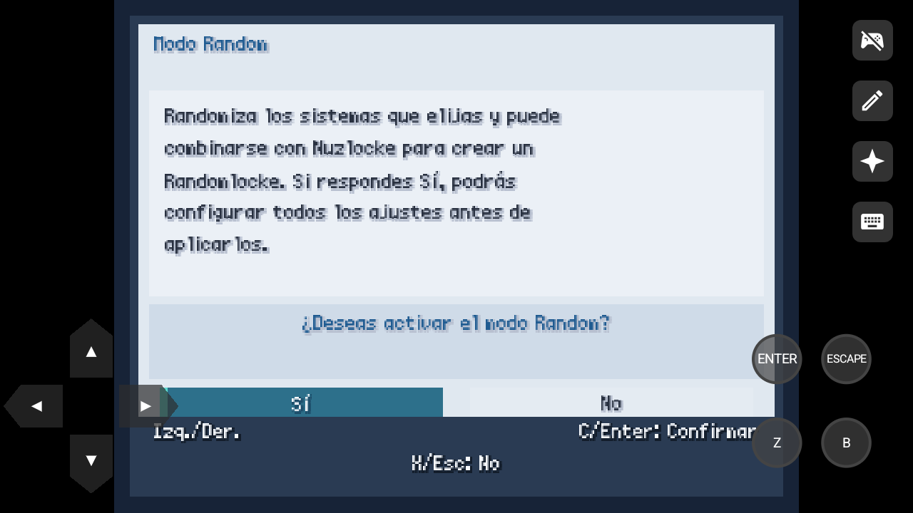
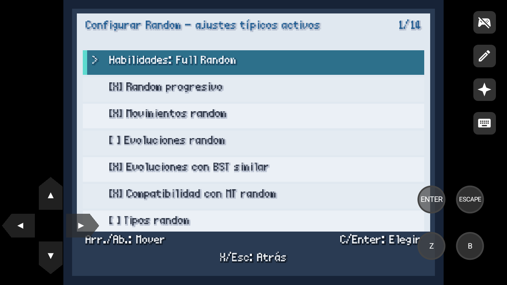
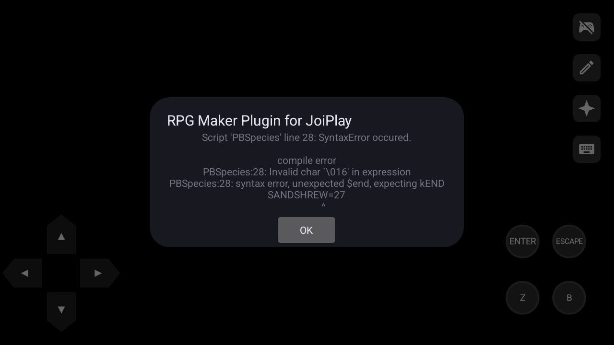
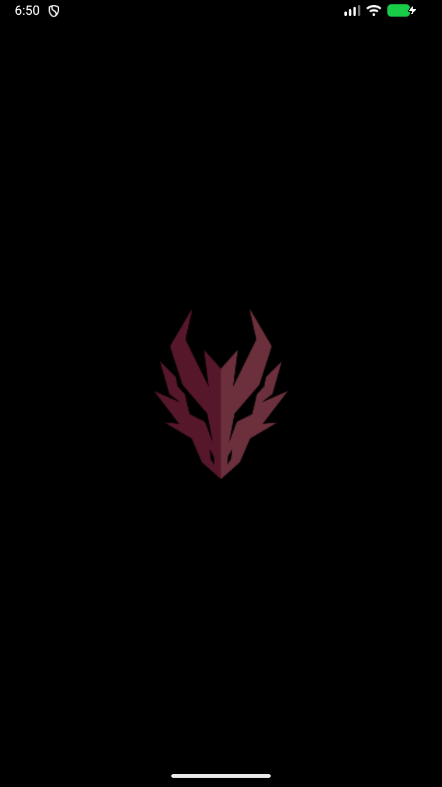

# Comprobaciones Android — 28 de septiembre de 2026

## Resultado

| Entorno | Resultado observado |
| --- | --- |
| JoiPlay 1.22.001-patreon + RPG Maker Plugin 1.23.00-patreon, Pokémon Z ES 2.18, código corregido | Arranque, 14 componentes del mod y perfil ES confirmados. Asistentes de activación y configuración Random abiertos durante una partida nueva. |
| Mismo JoiPlay, paquete Android publicado 1.1.2 | `LoadError` al cargar `./Mods/HardcoreNuzlocke/loader.rb`. No se considera validado. |
| APK instaladora 0.1-test, código actual | Selección de carpeta mediante Android SAF, copia del mod, copias de seguridad, verificación de archivos y confirmación posterior del registro probadas. |
| Kirin 0.3.5 / 0.4.0-beta4, Android virtual API 36.1 | El motor nativo falla antes de iniciar el juego. No confirma compatibilidad del mod. |
| Kirin 0.4.0-beta4, segundo Android virtual API 33 | Instalación rechazada: `INSTALL_FAILED_NO_MATCHING_ABIS`. Esa imagen solo expone x86_64 y no tiene traducción ARM64. |

Estas pruebas no certifican todos los teléfonos, otras versiones de los reproductores, las ediciones inglesa/francesa en Android ni una partida completa. No se completaron combate, guardado y recarga en Android. No se probó un teléfono ARM64 físico.

## Instalación reproducida

1. Android virtual con almacenamiento compartido y una copia de prueba de Pokémon Z ES 2.18.
2. JoiPlay y RPG Maker Plugin instalados desde sus APK oficiales, con permiso de almacenamiento. El RTP XP `xp_rtp104e.exe` se importó desde JoiPlay, sin ejecutar el archivo en Windows.
3. `Game.exe` añadido a la biblioteca de JoiPlay. Se probó primero el cargador publicado y después el corregido.
4. La APK propia se instaló con el mod corregido incluido. Mediante el selector Android se eligió `KirinTest/PokemonZ`, se confirmó ES 2.18 y se instaló.
5. Antes de arrancar, «Comprobar instalación» informó de archivos correctos pero carga pendiente. Tras arrancar con JoiPlay, confirmó el registro nuevo. El instalador guarda el registro anterior y lo vacía para evitar un PASS antiguo.
6. Durante la prueba de partida nueva se eligieron personaje, nombre, dificultad y el modo inicial. Tras los consejos y saltar la introducción narrativa, apareció la pregunta Random y se abrió su asistente. No se usó el controlador de pruebas `PZN_TEST_CONTROL` para producir esas capturas.











## Correcciones necesarias

El Ruby 1.8.1 de JoiPlay presentaba `$LOAD_PATH=[]`. El archivo del mod existía y podía leerse, pero el `load` relativo fallaba. Ahora `preload.rb` y la raíz del cargador usan rutas absolutas calculadas desde su ubicación.

Además, JoiPlay no exponía `$RGSS_SCRIPTS` durante el preload. El código anterior salía de `schedule_install!` sin programar los hooks. El cargador corregido espera mediante `Graphics.update` a que las clases del juego estén listas, aunque no exista esa tabla.

Después de reiniciar el AVD apareció otro problema: errores de evaluación en `PBMoves` y `PBSpecies`, cargados desde las constantes comprimidas del juego. Se reprodujo también con el mod desactivado ([registro sin mod](android-evidence/joiplay-restart-without-mod.txt)), y los hashes de `Scripts.rxdata` y `Constants.rxdata` seguían intactos. El preload ahora utiliza `MKXP.zinflate` únicamente si el motor es Android con Ruby 1.8 y ofrece ese método. No cambia la descompresión en Windows, en Ruby moderno ni en motores sin esa función. Esta adaptación se comprobó con arranques repetidos; no se atribuye el problema a una corrupción de los archivos del juego.

Se comprobaron **tres arranques consecutivos** con esta adaptación; el tercero fue después de reiniciar Android y reinstalar el mod desde la APK final. Los tres registraron `PASS (14 hooks)` y `Compatibility profile PASS`. Las capturas del asistente Random se obtuvieron antes de esta adaptación adicional; las capturas finales de instalación y comprobación corresponden a la APK final.



La copia local de desarrollo del juego contenía un antiguo `PZ Hardcore Nuzlocke Bridge` en `Scripts.rxdata`. Para evitar que ocultara el problema, se retiró **solo de una copia temporal de prueba**. Ni el juego original del PC ni los instaladores se modificaron para editar ese archivo. El SHA-256 de `Data/Scripts.rxdata` de la copia de prueba fue el mismo antes y después de usar la APK:

```text
dbd15b8a3962571c4c7f1d9d6ab869a000a1a607fa49f368ac9a35c204236548
```

El [registro nuevo de JoiPlay](android-evidence/joiplay-install.txt) confirma:

```text
Deferred runtime hook installed
Loader initialized; RGSS script table: unavailable; last=none
Hardcore Nuzlocke/Random setup installed successfully
Installation self-test PASS (14 hooks)
Compatibility profile PASS: es_218; language=es
```

Las pruebas y capturas se realizaron con el prototipo 0.1-test y el árbol de desarrollo previo a la publicación. Estas correcciones se distribuyen ahora en la APK y los ZIP de la release **1.1.3**. La APK pública usa una firma propia del proyecto y metadatos 1.1.3; los ZIP 1.1.2 antiguos no incluyen estas correcciones.

## Kirin: prueba controlada y limitación

Se probó inicialmente con 2 GB y luego con **8 GB de RAM y 8 núcleos**. El AVD principal usa API 36.1, arquitectura x86_64, traducción `libndk_translation.so` y ABI anunciadas `x86_64,arm64-v8a`. Kirin beta4 es una APK ARM64. Se probaron las selecciones de motor Auto/Ruby 1.8, Ruby 3 y Ruby 3+.

La última comparación usó la misma copia sin el bridge antiguo, primero con `preload.rb` vacío (mod desactivado), después restaurando el cargador instalado por la APK. En ambos casos regresó a la biblioteca sin iniciar el juego:

```text
KirinLoader: Native startup failed (2)
KirinLoader: Native startup failed (41)
```

Registros: [sin cargar el mod](android-evidence/kirin-without-mod.txt) y [con el cargador del mod](android-evidence/kirin-with-mod.txt). Esto demuestra que añadir RAM y activar/desactivar el mod no resolvió el arranque en ese entorno. No permite atribuir definitivamente el fallo a la traducción ARM ni afirmar que Kirin falle en móviles reales.



También se creó un AVD **Android 13/API 33, 8 GB, 8 núcleos**, con la imagen oficial Google APIs x86_64 r17. Su ABI era únicamente `x86_64`, con `ro.dalvik.vm.native.bridge=0`; Android rechazó instalar Kirin beta4 por arquitectura. No se llegó a ejecutar el juego en ese segundo entorno.

## Comprobaciones del código

- Pruebas en el Ruby 1.8.7 del juego Windows: preload con ruta relativa y load path vacío; selección del descompresor solo para Android/Ruby 1.8 con API disponible; tabla RGSS ausente, espera de clases, instalación y validación una sola vez, conservación de la actualización gráfica y del bridge existente.
- Pruebas Java del instalador Android: conservación del preload ajeno, idempotencia, configuración JSON con comentarios, perfiles de las tres ediciones, copia de seguridad, restauración de escrituras parciales y conservación de datos y partidas.
- Instaladores Python/PowerShell: autodetección, reinstalación, copias de seguridad y hash de `Scripts.rxdata` sin cambios en ES 2.18, EN 2.13 y FR 2.12 + Patch 1. Ejecutados con PowerShell 7 para interpretar correctamente las rutas francesas UTF-8.

Las capturas son archivos PNG directos del emulador. No se incluyen el juego, sus datos ni partidas en los paquetes del mod o del instalador.

Fuentes de las aplicaciones y requisitos: [JoiPlay y RPG Maker Plugin](https://www.patreon.com/posts/159457758), [Kirin beta4](https://www.patreon.com/kirin_app/posts/kirin-0-4-0-170033059), [RTP de RPG Maker](https://www.rpgmakerweb.com/run-time-package).
